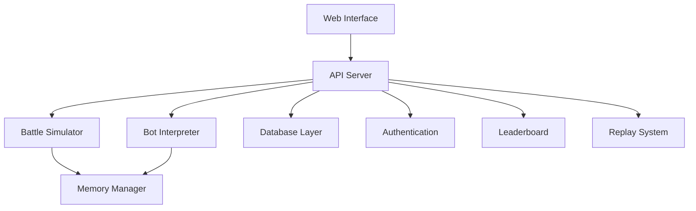

# ASM-Bots: Modern Core Wars Implementation

A web-based Core Wars arena with real-time memory visualization, battle simulation, and global leaderboards.

## System Architecture

### Core Components



### Module Structure

1. **Core Engine**
   - Memory space management (16-bit)
   - Instruction execution
   - State tracking
   - Battle coordination

2. **Memory Manager**
   - Memory allocation
   - Access control
   - State persistence
   - Real-time visualization

3. **Bot Interpreter**
   - x86-like assembly parsing
   - Instruction validation
   - Execution pipeline
   - Error handling

4. **Battle Simulator**
   - Turn management
   - Multi-bot coordination
   - State recording
   - Victory conditions

5. **Web Interface**
   - Real-time visualization
   - Battle controls
   - Bot management
   - Theme system

6. **API Server**
   - RESTful endpoints
   - WebSocket connections
   - Rate limiting
   - Error handling

7. **Database Layer**
   - Bot storage
   - Battle history
   - User management
   - Leaderboard data

8. **Authentication**
   - User management
   - Access control
   - Session handling
   - Security measures

9. **Leaderboard**
   - Ranking system
   - Statistics tracking
   - Achievement system
   - Historical data

10. **Replay System**
    - Battle recording
    - State playback
    - Timeline controls
    - Export/import

## Technical Specifications

### Development Stack
- Frontend: HTML5, JavaScript (ES6+)
- Backend: Node.js
- Database: SQLite
- Containerization: Docker
- Testing: Jest with 80%+ coverage

### Memory Space
- 16-bit addressable memory
- Real-time state tracking
- Visualization updates
- Access protection

### Bot Language
```assembly
; Example bot program
.org 0x100           ; Program start address
start:
    mov  ax, 0x200   ; Load target address
    call scan        ; Scan for enemies
    jmp  attack      ; Execute attack routine
scan:
    cmp  [ax], 0     ; Check memory contents
    ret
attack:
    mov  [ax], bx    ; Write attack pattern
    jmp  start       ; Repeat
```

### Battle System
- N-bot simultaneous battles
- Turn-based execution
- State persistence
- Victory conditions

### Theme System
- Dracula (default)
- Dark theme
- Light theme
- Monokai

## Development Setup

### Prerequisites
```bash
# Required software
- Node.js 18+
- Docker
- SQLite3
```

### Installation
```bash
# Clone repository
git clone https://github.com/username/asm-bots.git
cd asm-bots

# Install dependencies
npm install

# Setup development database
npm run setup:dev

# Start development server
npm run dev
```

### Testing
```bash
# Run test suite
npm test

# Generate coverage report
npm run test:coverage
```

### Docker Deployment
```bash
# Build container
docker build -t asm-bots .

# Run container
docker run -p 3000:3000 asm-bots
```

## Contributing

1. Fork the repository
2. Create a feature branch
3. Implement changes with tests
4. Submit pull request

### Code Standards
- ESLint configuration
- Prettier formatting
- JSDoc documentation
- Test coverage requirements

## License

MIT License - See LICENSE file for details

## Project Status

Under active development - See CHANGELOG.md for updates
