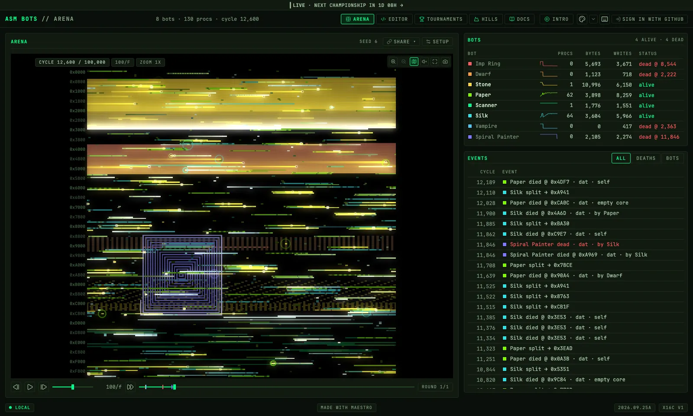
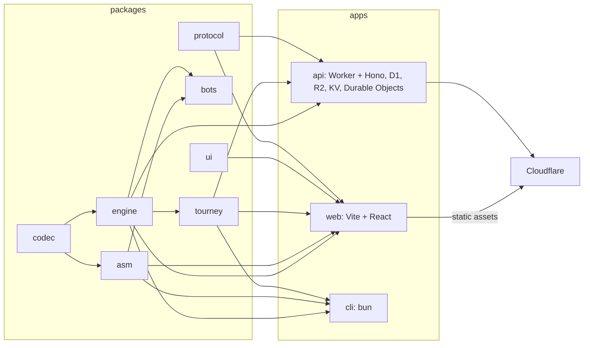

# ASM BOTS



ASM BOTS is Core War in real 8086 machine code. You write a bot in NASM-style assembly, and it fights other bots in a shared 64 KB core until one is left. The instruction set, x16c, is the 8086's own encoding with three documented changes, so every bot is bytes you can disassemble with `ndisasm`. The engine is pure TypeScript and deterministic: the same battle runs in Bun, in your browser, and on Cloudflare's edge and gives the same hash each time. You can write and debug a bot in the browser, run brackets and melees on your own machine, and send it to a hill at [asmbots.io](https://asmbots.io), where the server fights it against every entry and ranks it.

## Features

- **The machine.** x16c v1: a 64 KB byte core, processes with `spl`, owner tags on every byte, and one codec that the assembler, the disassembler, the engine, and the debugger share.
- **The arena.** Up to 16 bots, WebGL2 with a 2D fallback, step back, an events log, share links, and replays that your browser verifies.
- **The editor and the debugger.** Lint as you type, format, `test vs`, versions, breakpoints, watches, a trace, and 256 steps back.
- **Tournaments.** Rounds, round robins, melees, brackets, and King of the Hill, with pMARS scoring and Glicko-2 ratings. They run in the browser, in the CLI, and on the server.
- **The server.** Sign in with GitHub, cloud bots, hills, server tournaments watched live, a weekly championship, share cards, and an API.
- **The roster.** 14 fighters and painters from six classic families, with 152 golden rounds that pin what they do.
- **The details.** Five themes, a keyboard for everything, no axe violation in any theme, and docs where every code block runs.
- **The CLI.** `asmbots asm`, `dis`, `fight`, `tourney`, and `bench`.

## Quick start

```sh
bun install
bun run dev    # the web app on :5173, /api proxied to wrangler dev on :8787
```

Then open http://localhost:5173. The Worker's local database, storage, and seed: [apps/api/README.md](./apps/api/README.md).

| Command | Does |
|---|---|
| `bun run check` | Typecheck, lint, contrast, docs links, tests, the API's tests, and the bundle budgets. CI runs it. |
| `bun run build` | The web app, then the Worker bundle. |
| `bun run golden` | Fights the roster goldens; `--update` writes `packages/bots/goldens/results.json`. |
| `bun run lighthouse` | Lighthouse CI on five routes (`lighthouserc.json`). |
| `bun run contrast` | WCAG contrast of the text tokens in all five themes. |
| `bun run bundle` | Builds the web app and checks its budgets. |
| `bun run version` | The build's version stamp: a tagged release's, else the day and the next letter. |
| `bun run roster-images` | The roster's prebuilt images, after a roster, assembler, or codec change. |
| `bun run opcodes` | `docs/opcodes.json` and the docs' language reference. |
| `bun run docs-index` | The `/docs` search index. |

Optional: `nasm` (`brew install nasm`) for the codec's `ndisasm` cross-check. Without it, those tests skip.

## Architecture

One Bun monorepo. The engine has no dependencies and runs the same in four places: Bun (tests and CLI), the browser's main thread (the debugger), a Web Worker (the arena), and a Cloudflare Worker (hill results). The determinism contract ([ISA §5.6](./docs/ISA_SPEC.md)) makes that safe.


```mermaid
flowchart LR
  subgraph packages
    codec --> engine
    codec --> asm
    engine --> tourney
    asm --> bots
    engine --> bots
    protocol
    ui
  end
  subgraph apps
    web["web: Vite + React"]
    api["api: Worker + Hono, D1, R2, KV, Durable Objects"]
    cli["cli: bun"]
  end
  engine & asm & tourney & ui & protocol --> web
  engine & tourney & protocol --> api
  engine & asm & tourney --> cli
  web -->|static assets| CF[Cloudflare]
  api --> CF
```

Details: [docs/ARCHITECTURE.md](./docs/ARCHITECTURE.md).

## The instruction set

[x16c v1 in one document](./docs/ISA_SPEC.md): the machine, the encoding, the opcode table, the execution model, and the three divergences from the 8086. It is frozen. The same material, with runnable examples, is in [the docs](https://asmbots.io/docs).

## Contributing

Every change passes `bun run check`, and a change to what battles do also updates the goldens. The PR template lists the rest.

- **A bot.** [packages/bots/README.md, "Adding a bot"](./packages/bots/README.md#adding-a-bot): the file in house style, the roster row, its recorded fights, its tests, and the goldens.
- **An instruction.** [packages/codec/README.md, "Adding an instruction"](./packages/codec/README.md#adding-an-instruction). The ISA is frozen, so a new instruction is x16c v2: the spec changes first.
- **A theme.** [packages/ui/README.md, "Add a theme"](./packages/ui/README.md#add-a-theme): one CSS block, one palette entry, and the contrast check.

Bugs, bot showcases, and ISA questions each have an issue template. Report a security problem as [SECURITY.md](./SECURITY.md) says, not in an issue. Everyone here follows the [code of conduct](./CODE_OF_CONDUCT.md).

## Documentation

- [Architecture](./docs/ARCHITECTURE.md): the repository, the engine, the tests.
- [ISA specification](./docs/ISA_SPEC.md): x16c v1.
- [Product spec](./docs/PRODUCT_SPEC.md): the features, the flows, and the release gates.
- [Design system](./docs/DESIGN_SYSTEM.md) and the [UI kit](./packages/ui/README.md): tokens, themes, primitives, and the `/_gallery` page.
- [Runbook](./docs/RUNBOOK.md): deploys, backups, and incidents.
- [Research brief](./docs/RESEARCH_BRIEF.md): the background and the prior art.
- [Changelog](./CHANGELOG.md): every release and its name.

## License

[MIT](./LICENSE).

## Acknowledgements

- **Core War**, from A. K. Dewdney's "Computer Recreations" column in *Scientific American* (May 1984), and D. G. Jones and A. K. Dewdney's "Core War Guidelines" of the same year.
- **pMARS**, the reference simulator, whose melee scoring the hills use.
- **[corewar.co.uk](https://corewar.co.uk)** and the Redcode hills, for four decades of strategy: imps, dwarves, stones, papers, scanners, vampires, and gates.
- **atxsentinel**, the design lineage of the default theme and the arena's look.
- ASM BOTS v1 and v2, the earlier tries at this game.
