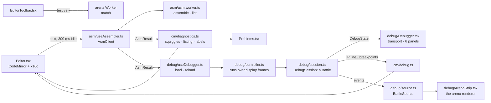

# @asmbots/web

The ASM BOTS web app: Vite 6, React 19, TanStack Router (file routes under `src/routes/`) and
Query, Zustand, and the `@asmbots/ui` kit.

| Script | What it does |
| --- | --- |
| `bun run --filter @asmbots/web dev` | Dev server on http://localhost:5173 |
| `bun run --filter @asmbots/web build` | `tsc -b`, then the production build in `dist/` |
| `bun run --filter @asmbots/web preview` | Serves `dist/` on http://localhost:4173 |
| `bun run --filter @asmbots/web test` | Unit and component tests (`test/`), the arena Worker in Bun's real `Worker` |
| `bun run --filter @asmbots/web e2e` | Playwright (`e2e/`): the build, and the dev server for `/_gallery` and the arena Worker |

## Docs

`/docs` pages are MDX in `src/docs/`: a page at slug `machine/memory` is `machine/memory.mdx`,
listed in the sidebar tree `src/docs/nav.ts` (a test holds every file to a page). MDX compiles
with GitHub tables and fenced-block meta (`src/docs/remark.ts`). A page uses these blocks with no
import (`src/docs/components.tsx`):

| Block | What it draws |
| --- | --- |
| ```` ```asm run="vs=imp" ```` or `<Asm run="vs=imp">` | x16c in the editor's colors, `copy`, `open in editor`, and with `run`, `open in arena` against that roster bot, or a melee against several (`vs=dwarf,stone,paper`, up to 15); `seed=7` fixes the seed. `fragment` marks a piece of a bot: copy only |
| `<Encoding form="mov r/m16, imm16" />` | A form's bytes from `docs/opcodes.json`: opcode, ModR/M, displacement, immediate |
| `<Flags op="add" />`, `<Flags set="CZ" />` | The ODITSZAPC row, changed flags lit |
| `<Keys>g a</Keys>`, `<Keys>ctrl+enter</Keys>` | Keycaps: a chord, a combination |
| `<Note>`, `<Warn>` | Callouts |
| `<Fig src="modrm" alt="…">caption</Fig>` | An SVG of `src/docs/figures/`, drawn inline in theme colors |
| `<KeyMap />` | Every key of the app, from the key tables of `src/app/keymaps.ts` |

A code block's colors and links load once the page has painted and gone idle
(`src/docs/asm-runtime.ts`: the CM tokenizer and the share codec; `usePaintedAndIdle` in
`src/app/paint.ts`, which the home demo also waits on). In a block, comments are `--text-muted`,
not the editor's `--text-dim`: in the docs they are prose. Links in prose are underlined, not
only accent-colored. The sidebar's search (`/`) reads a prebuilt index of every page's
headings and prose, `src/docs/generated/search-index.json`: run `bun run docs-index` after
editing a page (`test/docs-index.test.ts` fails on a stale index). `test/docs.test.tsx` compiles
and draws every page, and assembles every `open in editor` snippet with zero errors.
`test/docs-machine.test.ts`, `test/docs-strategy.test.ts`, and `test/docs-guide.test.ts` run
what the pages claim: every record table is fought again, every roster bot on a page must be the
roster's file word for word, and each "try" edit is made and measured. Change a bot, the engine,
or a page, and they say which words no longer hold.

`bun run docs-links` (in `bun run check`) checks every link of every page: a `/docs/…` path is a
page of `nav.ts` and its `#anchor` one of its headings, any other path a route of
`routeTree.gen.ts`, an outside link `https://` (not fetched), no relative paths, and each `Fig`
and `Shot` a real file. It prints `file:line: why` per broken link.

## Arena

The arena lives in `src/features/arena/`: `worker/protocol.ts` has the Worker's messages,
`worker/session.ts` the battle and its keyframes, `worker/frames.ts` the frames of a battle (the
sink that gathers its events, and the builder the debugger's arena strip shares), and
`worker/client.ts` the `ArenaClient` and the `useArena` store. `ArenaCanvas.tsx` draws a client's frames: `render/scene.ts` keeps the core
mirror and the glows, `render/gl.ts` and `render/shaders.ts` draw it with WebGL2 (bloom,
scanlines, and vignette from `render/post.ts`), `render/canvas2d.ts` is the 2D fallback,
`render/camera.ts` zooms and pans, and `render/overlay.ts` draws the rulers.

### Routes

`/arena` is `ArenaPage.tsx`: `ArenaSetup.tsx` until the fight button, then `ArenaBattle.tsx`. The
URL holds the setup, `?b=roster:dwarf,local:<id>&seed=42&cycles=100000&rounds=3&procs=64&spacing=1024`
(`setup/url.ts`; no `seed` is a random seed each battle), and a share link carries its local bots'
sources in `#src=` (deflated JSON, base64url). `setup/search.ts`, the route's `validateSearch`,
imports nothing, since it rides the entry chunk. `setup/config.ts` has the limits and the presets,
and `setup/bots.ts` the roster, the local and shared bots, dropped files, and the fight button's
words. `vite.config.ts` loads the roster's `.asm` imports as text (`textImport`, which also reads the docs'
figures).

`ArenaBattle.tsx` is the battle, its parts in `battle/`: `Hud.tsx` (a band over the core that the
camera keeps clear), `Transport.tsx` (the scrub bar marks keyframes and bot deaths), the rail's
`BotsPanel.tsx`, `EventsPanel.tsx`, and `StandingsPanel.tsx`, `Victory.tsx`, the hover tooltip
`HoverTip.tsx`, and the keys (`space . , [ ] 0 1-9 f s m`) in `keys.ts`. `log.ts` turns the Worker's
messages into the round's timeline, `view.ts` holds what the player picked (isolated bots, the
minimap, autoplay), `screenshot.ts` and `replay.ts` write the PNG and the `.asmreplay.json`. A load
is a match: the Worker plays round i with `@asmbots/tourney`'s `roundOrder` and `roundSeed` and
scores it with `withRound`, so the arena's match equals `runMatch`'s. Frames name bots by their
place in the load, whatever order a round fights them in.

`/arena/$replayId` is `ReplayPage.tsx`: a replay in the same battle view. The victory's
`replay link` copies `/arena/<match key>#r=<base64url of the replay's JSON>`: `@asmbots/protocol`'s
`Replay` (the `download replay` file), with the bots' bytes and SHA-256 but not their sources.
`battle/replay.ts` still reads the arena's older `asmbots-replay-local/1` files and links. The page loads it into the Worker and plays at once.
`battle/verify.ts` checks each bot's SHA-256, then that the Worker's match key (`matchHash` of the
replay's inputs) is the recorded one, then each round's result hash as the round ends. The chip
beside the arena's title says `verifying`, `verified 1/3`, `verified` in accent, or `mismatch` in
danger with the reason in its title and on the victory. A link is held to what the arena runs (2
to 16 bots, 10 rounds, 1M cycles, 256 processes a bot) before anything loads. On a replay, `share`
copies its link, `download replay` saves it as it came, and `setup` goes to `/arena`. A link with
no `#r=` will load the replay from the API (TODO(EXEC 3.1) in `ReplayPage.tsx`).

The home page's hero is `demo/HomeDemo.tsx`, driven by `demo/demo.ts`: Spiral and LCG painters,
Dwarf, and Paper in the duel config, 400 cycles a frame, a new random seed that places them each
battle, and 3 s on each battle's end before the next. `DemoLoop` pauses the battle while the tab
is hidden or the hero is off screen. `ArenaCanvas` draws it with `interactive={false}`: a
`role="img"` picture with no HUD, minimap, hover, or keys, which the wheel scrolls past. Bloom
follows the settings, on by default. Under reduced motion the hero is a still: battle 62 at
cycle 24,000, all four bots alive, painted by the 2D renderer's `CorePainter` onto a 256 x 256
canvas. `HomePage.tsx` loads the demo after the page's first contentful paint and an idle moment,
so its 65 KB gz (the renderer, the roster, the engine, and the Worker) costs `/` nothing in
Lighthouse. The demo makes no sound.

### Sound

`src/features/sound/engine.ts` synthesizes DESIGN_SYSTEM §7's cues with WebAudio, no samples: a
tick, a write click (band-passed noise), a process death's thud, a bot death's falling tone (from a
pentatonic step per hue), the victory (root, fifth, octave), and the transport's click. Sound is
off until `m` in a battle, the HUD's sound button, or `/settings` (master volume, one switch per
cue) turns it on. No AudioContext exists before the page's first gesture (`keydown` but `esc`,
`mousedown`, a touch's `pointerup`), so a replay that plays at load stays silent until one. The
budget: 12 cues in any second; tick, write, and death at most every 125 ms and 8 a second; clicks
10; bot deaths and the victory the rest. Writes coalesce into one click per 250 ms, as loud as the
writes it stands for. `sound/arena.ts`'s `useArenaSound` plays a battle's cues in `ArenaBattle`
(`/arena` and replays); full frames (a load, a seek) are silent. The home demo, the live panel, and
a tournament's watch modal play by themselves and stay silent. The synth builds as a small
`engine-*.js` chunk beside the machine's `engine-*.js`; a `manualChunks` rule for it would pull
the kit out of the entry. Tests: `test/sound.test.ts` on `test/fake-audio.ts`, and
`e2e/sound.spec.ts`, which takes away the user activation Playwright's `goto` gives a page.

### First visit and the intro

A first visit to `/arena` gets a three-step tour (PRODUCT_SPEC §9, `tour.tsx`), one kit `CoachMark`
at a time: `1/3` under the first roster card's `+` until two bots are picked, `2/3` over the fight
button, `3/3` in the events log once the battle shows (`placement="inline"`, so the newest lines
stay in view). Doing a step moves the tour on. `skip the tour` or `got it` puts it away for good,
as does `setup` from the battle it ends on (`coachMarksSeen` holds `arena`, beside the editor's
`editor`).

The header's `intro` links to `/arena?intro=true`: `ArenaPage` loads Dwarf vs Imp at seed 263
(`intro.tsx`; Dwarf's bomb lands on Imp's next word at cycle 55,602, first blood and the end),
writes that setup to the URL, and sets 200 cycles a frame. Its guide (`useIntroGuide`, three marks)
holds the placement 6 s (or until `play now`), plays, points at the events log at first blood,
then offers `pick bots` (the setup, with the intro's bots in) and `done`. About 30 s in all. The
tour stays out of the intro's battle, and picks up in the setup after it.

### Worker protocol

The Worker (`worker/arena.worker.ts`) is an `ArenaSession` behind `postMessage`. It runs cycles
only when asked, never on its own. Every typed array it sends is transferred, not copied.

| Request | Answer |
| --- | --- |
| `load { bots, config, rounds }` | `loaded`, then a full frame of round 1 at cycle 0 |
| `setRound { round }` | `loaded`, then a full frame: a round played before, or the next |
| `step { cycles }` | a frame |
| `seek { cycle }` | a full frame |
| `requestFrame` | a frame of `speed` cycles, only while playing |
| `play`, `pause`, `speed { cyclesPerFrame }` | nothing, or an `error` |
| `match { bots, config, rounds }` | `match { match }`: the whole match headless, as `runMatch` gives it, or an `error` |

- `match` (the editor's `test vs`) runs beside the battle and leaves it as it was: no frames,
  and `ArenaClient.runMatch` settles its calls in the order it sent them.
- Each request that moves the battle (`load`, `setRound`, `step`, `seek`, `requestFrame`) gets
  exactly one `frame`, or an `error` in its place. `ended { result, hash, round, match }` follows
  the frame that ends a round. A failed request leaves the battle as it was.
- A frame is what changed: written bytes as (address, byte and owner tag) pairs with each byte's
  write cycle, run bytes as (address, bot) pairs, each live process's IP (`IP_FRONT` on each bot's
  front process), the spawns, deaths (with the killer's tag), and bot deaths, and 3 stats per bot
  (processes, bytes owned, writes). A full frame (`load`, `setRound`, `seek`) carries the whole core
  and owner map instead, and every bot dead by then.
- Pacing: `ArenaClient` asks for one frame per display frame, and never while one is owed, so a
  slow or hidden tab slows the battle instead of queueing frames. A frame runs `speed` cycles
  (1 to 10,000, or `max`) and stops early at 12 ms (`FRAME_BUDGET_MS`): a slow machine gets fewer
  cycles per frame, not fewer frames. A seek waits while frames are owed, and a later seek
  replaces it, so a scrub drag sends its last.
- Seeking: a keyframe `snapshot()` every 1,000 cycles, 128 at most, dropping the one farthest from
  the playhead. A seek restores the latest keyframe at or before its target and runs forward with
  the frame's events off.
- A match's round i fights the bots in `roundOrder` with `roundSeed` (ISA §5.5). The messages name
  bots by their place in the load, so a bot keeps its hue from round to round.

### Renderer passes

`render/gl.ts` draws only when something moved: a frame, a glow or ring still fading, the camera,
or a setting. Each image:

1. Uploads what changed, each texture whole, 256 x 256: the owner map (R8UI), a non-zero bitmask
   (R8UI, a bit a byte), and the write and exec ages in ms (R16UI).
2. The scene pass (`ARENA_FRAG` on one full-screen triangle): each byte its owner's hue at 0.55
   alpha, or 0.22 when the byte is zero; the exec trail `exp(-age/600)` in yellow; the write flash
   `exp(-age/220)` in white; the lattice from zoom 4. A dead bot's territory desaturates 40%;
   isolation dims the others to 20%. Then the death ripples and spawn pulses (`RING_*`, instanced,
   256 at most) and one marker per live process (`MARKER_*`, instanced). The pass writes two
   targets: the color, and the emissive light alone (trails, flashes, markers, rings).
3. Bloom: the emissive target down to quarter size (`DOWNSAMPLE_FRAG`, a 4 x 4 mean), a 9-tap
   Gaussian across and then down (`BLUR_FRAG`).
4. Composite onto the canvas (`COMPOSITE_FRAG`): the color, plus the bloom at the theme's strength,
   times the scanlines and the vignette (`render/post.ts`: paper has neither). With all three
   effects off, the scene pass draws straight onto the canvas.
5. Zoomed in, the minimap: the owner map again, small, with the view's outline.

The rulers and the hover crosshair are a 2D canvas over it (`render/overlay.ts`). Where WebGL2 is
missing, `render/canvas2d.ts` paints the core on the CPU (`CorePainter`, repainting only the
bytes that changed or still glow) and draws it scaled, with the same colors and no post effects.

### Performance

Measured on an M5 Max in headless Chromium 1243, 2026-09-23.

| What | Where | Result |
| --- | --- | --- |
| `ArenaSession`, 16 roster bots, 2,000 cycles a frame | Bun | p50 1.1 ms, p95 2.8 ms a frame; seeks 0.2 to 6 ms |
| `e2e/arena-perf.spec.ts`, 16 bots, 2,000 cycles a frame, all effects | 1280 x 720, DPR 1 | p50 16.7 ms, p95 16.8 ms frame gap |
| The battle page, same melee (HUD, rail, sparklines, log) | 1280 x 720 DPR 1, 1440 x 900 DPR 2 on Metal | p95 16.7 ms, no long tasks |
| The home demo, 4 bots, 400 cycles a frame, bloom | 1280 x 720 DPR 1, 1440 x 900 DPR 2 on Metal | p95 16.7 ms, max 16.8 ms |
| Cold JS | `/arena`, `/arena/$replayId`, `/` | 222.8, 214.7, and 145 KB gz, then 65 KB gz of demo on `/` |
| Cold JS with the editor (EXEC 2.4), 2026-09-23 | `/arena`, `/editor` | 226.8 KB gz (the editor's icons, `Toolbar`, and the chunks it shares with the arena: +3.5); 356 KB gz, of which CodeMirror is 124 and the assembler Worker 17 |
| Cold JS with the debugger (EXEC 2.4), 2026-09-24, every JS response of a cold load, gzipped | `/arena`, `/editor` | 229.9 KB gz (226.3 before, the same way: the engine's snapshots, which the `engine` chunk takes, and chunks shuffled between the routes); 401.1 KB gz (356.0 before) |

Headless Chromium's WebGL is SwiftShader (software) unless launched with `--use-angle=metal`. It
holds 60 fps at DPR 1; at DPR 2 with bloom the melee's p95 is 33 ms. The renderer's first images
under SwiftShader make one long task of about 120 ms (half with the post effects off), which
the home page moves past its first paint.

The renderer's Playwright specs drive `e2e/harness/arena.html`, a page only the dev server serves.
`e2e/arena-perf.spec.ts` (16 roster bots at 2,000 cycles a frame, p95 frame gap at most 20 ms) is
its own project and runs after the rest: `bunx playwright test --project perf --no-deps` runs it
alone.

### Adding an effect

1. State: keep it in `render/scene.ts`. Take its data from the frames in `applyFrame` (or add a
   field to the frame in `worker/protocol.ts` and `worker/frames.ts`), move it along in `advance`,
   bump a `*Version` counter when it changes, and push the matching `…Until` time out while it
   still moves, so `advance` reports the image as changed until it is done.
2. Draw it in both renderers. WebGL2: a uniform or texture that `ARENA_FRAG` reads, or an
   instanced pass like `RING_*`, in `render/shaders.ts`, with its upload in `render/gl.ts`. Light
   that should bloom goes to the emissive target too. 2D: `CorePainter.paintCell`, or a draw over
   the core in `render/canvas2d.ts`.
3. A post effect: its strength per theme in `THEME_POST` (`render/post.ts`), a switch in
   `ArenaEffects` (`store/settings.ts`, `sanitizeSettings`, and the settings page), and its math
   in `COMPOSITE_FRAG`.
4. Motion: under reduced motion (`scene.reducedMotion`) an effect that moves must not, as the rings
   do not.
5. Tests: the state in `test/arena-scene.test.ts`, the 2D pixels in `test/arena-canvas2d.test.ts`,
   the WebGL pixels in `e2e/arena-render.spec.ts`, and then `e2e/arena-perf.spec.ts` alone.

## Editor and debugger

`/editor` is a new bot; `/editor/<id>` a bot of this browser; `/editor/roster-<slug>` a roster
bot, read-only, with `fork`. `/editor?b=…` (the arena's `open in debugger`) opens the setup's first
bot, `/editor#src=…` (the editor's `share`) opens a bot not saved yet, and `/editor?t=dwarf` starts a
new bot from a template. The code is in `src/features/editor/`; `EditorRoutes.tsx` turns the URL
into a document, and `EditorPage.tsx` (its `Workbench`) lays the page out and owns every action.

### Architecture

Two Workers and one main-thread battle. The assembler Worker turns the text into bytes; the
debugger runs its own `Battle` on the main thread, so a step stops between any two cycles; the
arena Worker plays `test vs` headless.



| Part | Where |
| --- | --- |
| Assemble on idle | `asm/useAssembler.ts` sends the source to `asm/asm.worker.ts` 300 ms after the last change (the first at once); only the answer to the last request counts. `asm/run.ts` assembles at the 512-byte cap, lints, and measures a bot past the cap. `asm/client.ts` falls back to the main thread if the Worker fails. |
| Results in the editor | `cm/diagnostics.ts`: `showResult` hands a result whose source the editor still holds to `@codemirror/lint` (`setDiagnostics`: squiggles, tooltips with the fix, `lintGutter` marks) and to `setAssembled`. `problemsOf` reads the mapped findings back for `Problems.tsx`. |
| Listing gutter | `cm/listing.ts`: `0x000D  C7 05 00 00` per line from the last assemble without errors, mapped through edits until the next; `l` shows and hides it. |
| Toolbar | `EditorToolbar.tsx`: name, `%name`, size (warn from 90%, danger past the cap), assemble (Mod-Enter), format (Shift-Alt-f; `diff.ts` turns the formatter's text into small changes so the cursor stays in its token), lint, save (Mod-s), versions, share, `test vs ▾`, templates, listing. |
| New bot | `EmptyEditor.tsx`: while `/editor` holds the blank template as it comes, or no text, the templates sit over the editor, under the blank bot's lines. A template starts the bot from it (`?t=`, one edit that undo takes back); `blank` keeps the blank bot and selects its name; typing or `close` puts the panel away. |
| First visit | The kit's `CoachMark` under the debugger's run button: "assemble runs as you type; press F5 to debug". It goes for good on `got it` or on the debugger's first move (`useCoachMark('editor')`, `coachMarksSeen` in `store/settings.ts`). |
| Storage | Local bots in IndexedDB (`store/local-bots.ts`), the last 20 saves of each in their own database (`store/bot-versions.ts`); the switches, the recent list, and each unsaved text (a draft) in `localStorage` (`store.ts`). |
| `test vs ▾` | `test-vs.ts`: ten rounds of the duel against a roster bot in the arena Worker (`match`), shown as `W 7 · T 2 · L 1 vs imp`; `watch` opens `/arena` with the same bots and seed. |
| Debugger core | `debug/session.ts`: `DebugSession` runs a `Battle` on the main thread, a cycle at a time: step (one instruction of the followed process), step over (`call`, REP), step out, run to cursor, run until death, run N, and step back through the last 256 snapshots (a cycle at a time through a run). Each process's last 200 instructions (`debug/trace.ts`), register edits, and runs in parts (a budget of cycles) are the session's too. |
| Debugger page | `debug/useDebugger.ts` loads the editor's last assemble without errors with the opponents and seed (`?b=…&seed=…` start them), again by itself until the session moves, then on `reload`, carrying breakpoints by line (`debug/load.ts`). `debug/controller.ts` runs over display frames (8 ms of each, or the speed) and shows a run 10 times a second. |
| Debugger panels | `debug/Debugger.tsx`: the load bar, the transport, and Registers, Processes, Memory (`debug/memory.ts`: 32 rows swept from the listings' known starts), Watch, Breakpoints, and Trace (the CLI's trace format). `cm/debug.ts` puts the IP line and the breakpoint gutter in the editor. |
| Arena strip | `debug/ArenaStrip.tsx`: the arena's renderer on `debug/source.ts`, a `BattleSource` that taps the session's events with the arena Worker's frame builder (no Worker), locked on the followed IP; it folds with the kit's `SplitPane` (`collapsed`). |

The bot library (`Library.tsx`, `b`) lists recent documents, my bots, and the roster.

### Keymap

The function keys go through one window listener (`debug/keys.ts`): they work in the editor and in
the panels' fields, and never reach the browser, where F5 reloads and F11 goes full screen. The
page keys are the app's keymap: a text field keeps them while it has the focus, and Esc leaves the
editor (a popup or the search panel closes first). `?` lists them all. Every key's words live in
`src/app/keymaps.ts`, which the hooks, the key help, and the docs' keyboard map all read.

| Key | Where | Does |
| --- | --- | --- |
| Mod-Enter | editor | assemble now |
| Shift-Alt-f | editor | format |
| F8 | editor | go to the next problem |
| Tab, Shift-Tab | editor | the next 8-column stop; one stop out |
| Ctrl-Space | editor | completion (CodeMirror's keys: search, undo, and the rest, work too) |
| Esc | editor | leave the editor |
| Mod-s | anywhere | save |
| F5, F6 | anywhere | run, pause |
| F9 | anywhere | set or clear the breakpoint on the cursor's line |
| F10, F11, Shift+F11 | anywhere | step over, step, step out |
| `space` | page | run or pause |
| `.`, `,` | page | step, step back |
| `[`, `]` | page | slower, faster runs |
| `0` | page | the strip's whole core |
| `b`, `l` | page | the bot library, the listing gutter |

### Breakpoints

A breakpoint is an address in the `DebugSession`, never an INT3 in the core. Before each cycle the
session reads the front process of each living bot, the one that runs in that cycle, and stops
when one stands on an enabled breakpoint whose condition holds (`check` in `debug/session.ts`). No
turn can change another bot's queue or registers before its own turn, so the check before the
cycle is exact. The core stays as the arena has it: an opponent can neither read a breakpoint nor
bomb it, and the debugger's battle is the arena's, cycle for cycle.

- **Setting one.** A press on the gutter left of the line numbers, F9 on the cursor's line, a press
  on a memory row, or an address or a label in the Breakpoints panel.
- **Lines and addresses.** Each line with bytes carries a marker from the loaded bot's listing
  (`cm/debug.ts`): the line's offset plus the bot's base, which the seed moves. The markers map
  through edits, so a line keeps its address until the next load, and a line typed since has none.
  A `reload` moves each breakpoint in the bot's bytes to its line's new address (`debug/load.ts`);
  one elsewhere in the core keeps its address.
- **Conditions.** `ax == 0x10 && cx < 3`, typed in the Breakpoints panel. `@asmbots/asm`'s
  `parseCondition` reads each side as the assembler reads an expression (number forms, operators,
  precedence) over the registers, their byte halves, `ip`, `flags`, and `cf pf af zf sf tf if df of`;
  `$` is the IP. Values wrap to 16 bits and compare unsigned. A condition that cannot be evaluated
  (a division by zero) stops the move and says why.
- **Hits.** Each breakpoint that holds before a cycle counts a hit; when two hold in the same cycle,
  the first in turn order is the stop. `reset` keeps the breakpoints and zeroes their hits.
- **Resuming.** A move never stops where it starts: `run` from a breakpoint runs the instruction
  there first, as a debugger resumes.
- **INT3.** ISA §3.6 makes INT3 a breakpoint in the debugger: the session stops before a process
  runs an INT3 its own bot owns, and the next move runs it, so the process dies as in the arena. An
  INT3 another bot wrote is a bomb, and kills without a stop.

### Adding a template

1. Write its source in `templates.ts` as a constant, in the formatter's layout, with `%name`,
   `%author`, and `%strategy`. A roster bot needs no copy: `templateSource` takes it from
   `rosterCatalog()`, as `imp` and `dwarf` do.
2. Add its id to `TEMPLATE_IDS` (lowercase letters: `?t=` takes `[a-z]{1,32}`), its entry to
   `TEMPLATES` (`label`, the menu's text; `detail`, the empty state's second column, 28 characters
   at most), and its case to `templateSource`.
3. The toolbar's templates menu, the new bot's empty state, and `/editor?t=<id>` pick it up.
4. Test: `test/editor-docs.test.ts` assembles every template (no error, no lint warning), checks
   that the formatter leaves it as it is and that its detail fits; add its label to that test's
   list and to the empty state's in `test/editor-page.test.tsx`.

A snippet that goes in at the cursor, such as the base idiom, is not a template: it is an entry of
`SNIPPETS` in `cm/complete.ts`, which completion and the menu's `base idiom` share.

## Tournaments

Local tournaments (PRODUCT_SPEC §4) run in this browser: the arena Worker plays the matches,
headless, and `@asmbots/tourney` schedules and scores them. The code is in
`src/features/tournaments/`. EXEC 3.3 adds server-run tournaments on the same views.

| File | What it holds |
| --- | --- |
| `store.ts` | The `Tournament` record in IndexedDB (`asmbots-tournaments`), its query hooks. A local bot's source is copied in, so a later edit changes nothing. |
| `runner.ts` | `tournamentRunner()`, the page's runner: `iterateRoundRobin`, `iterateBracket`, or a melee a round at a time, saved after every match. `start`, `pause`, `cancel`; `useRunnerSync()` keeps the query cache current and resumes what a reload left `running`. |
| `create.ts`, `NewTournament.tsx` | The new tournament form: entrant limits (bracket 3..32, melee 2..16, round robin 2..32), the match count and time estimate, the fixed seed. |
| `TournamentsPage.tsx` | `/tournaments`: cards, kind and status filters, search. |
| `TournamentPage.tsx`, `TournamentHeader.tsx` | `/tournaments/$id`: the header (name, kind, status, controls, `share`, entrants with the champion in accent) over the view of the kind. |
| `BracketView.tsx`, `RoundRobinView.tsx`, `MeleeView.tsx` | The views: `BracketSvg` (the CLI's `bracketSvg`, themed), `ResultsMatrix` and `StandingsTable`, the melee's survival histograms. Each has its `MatchPanel`. |
| `TournamentControls.tsx` | The status chip, `start` / `pause` / `resume` / `cancel`, and `auto-watch`. |
| `watch.ts`, `WatchModal.tsx` | A round rebuilt from its inputs and played in the arena; a recorded round checks its result hash. |
| `export.ts` | `results.json`, `bracket.svg`, `standings.csv`. |
| `share.ts` | Tournament links. |

A tournament on the page is this browser's by that id. When there is none, the page reads the
link's fragment. `share` copies `/tournaments/<id>#t=<base64url of the deflated JSON>`, schema
`asmbots-tournament-link/1`: the name, kind, status, config (written out in full), rounds, a
bracket's seeding and third-place flag, the entrants, and every match played. A roster bot travels
as its slug; a local bot as its machine code in base64url, up to 512 B (`MAX_BOT_BYTES`, so every
bot that assembles), and so its rounds can be watched from the link. The page rebuilds the
bracket, standings, progress, and champion from the matches with `@asmbots/tourney`, and rejects a
link whose matches do not fit its entrants (`this tournament link is broken: …`). A shared
tournament is read only: it has no controls, nothing stores it, and one shared while running reads
`paused`.

Tests: `test/tournaments-*.test.ts(x)` (store and runner, form, list, bracket, views, share and
detail page) and `e2e/tournaments.spec.ts` (a bracket and a round robin to the end, and the round
robin's link opened in a fresh browser).

## Empty and error states

Every list says when it is empty with the kit's `EmptyState` (DESIGN_SYSTEM §4, §9): one muted
sentence and one accent action. A link action goes through `app/link-action.ts`
(`useLinkAction`), a real `href` the router takes over on a plain click.

| List | It says | Its action |
| --- | --- | --- |
| Hills (`/hills`) | no hill is open yet. | see how hills work (`/docs/tournaments/hills`) |
| A hill's standings, its feed; the home page's top 10 | no entrants yet. / no submissions yet | submit a bot: the hill's own `submit` dialog, `sign in to submit a bot` signed out; the home page links `/hills/main` |
| Matches (hill, home) | no matches played yet. | fight one in the arena |
| Tournaments | no tournaments yet (this browser, the server) / no tournament matches. | new tournament / clear the filters |
| My bots: arena, library, profile, submit and enter dialogs | none saved in this browser yet. / no bots in your account yet | write a bot, save this bot, write a new bot, open the editor |
| Roster and my bots, searched | no roster bot matches "x". | clear the search |
| Versions (the editor's `versions`, open for any bot that can be saved) | no saves yet | save now |
| Watch | nothing watched yet | watch ip |
| Breakpoints | no breakpoints yet | break on the cursor's line (F9's work) |
| Events | no events yet. (every filter keeps the round's first line, so only a round not loaded) | play |
| A bot's hill placements; a profile's hills and championships | not on any hill yet. / on no hill yet. / no championships yet. | see the hills, see the tournaments |

A read of the API that fails draws `app/LoadFailure.tsx` in its panel: `could not load: <the
API's words>` and `retry`, which refetches. TanStack Query v5 clears the error of a read that has
no data when it fetches again, so the panel shows its loading state until the answer.

Offline (the browser's `offline` event), the status bar's left end trades `● local` for
`○ offline` and `arena, editor, and local tournaments still work`, in a live region
(`app/online.ts`), and a failed read says it will load once the network is back (TanStack
refetches on reconnect). The limit: there is no service worker, so the arena and the editor work
offline with the code the page has already loaded (the arena's Worker starts with its first fight,
the assembler's with the editor). A route never opened needs the network; TanStack's lazy routes
reload the page when a chunk does not come.

## Lighthouse

Lighthouse 12.8.2 on `/` from `preview`, Chromium 1243 (Playwright's), headless, 2026-09-23, with
the home demo (EXEC 2.3), three mobile runs and two desktop runs.

| Run | Performance | Accessibility | Best practices | SEO |
| --- | ---: | ---: | ---: | ---: |
| Mobile (default throttling) | 94 to 95 | 100 | 96 | 100 |
| Desktop (`--preset=desktop`) | 100 | 100 | 100 | 100 |

Mobile: FCP 2.3 s, LCP 2.6 s (the ticker), TBT 0 ms, CLS 0. Desktop: FCP 0.5 s, LCP 0.6 s. The
build before the demo scores the same: the demo loads after the first contentful paint. Loaded at
the `load` event instead, which comes before the app's first render, it cost mobile 5 points
(LCP 3.2 s).

Fixed in the app shell's pass: the missing favicon (a 404 in the console, best practices 93) and
the missing `robots.txt` (the SPA fallback served HTML, SEO 91).

`/docs`, 2026-09-24 (EXEC 2.6 task 5), same setup, three mobile runs and one desktop run:

| Page | Performance | Accessibility | Best practices | SEO |
| --- | ---: | ---: | ---: | ---: |
| `/docs`, mobile | 95 | 100 | 100 | 100 |
| `/docs`, desktop | 100 | 100 | 100 | 100 |
| `/docs/strategy/imps`, mobile | 94 | 100 | 100 | 100 |
| `/docs/reference/string`, mobile | 93 | 100 | 100 | 100 |

Mobile `/docs`: FCP 2.1 s, LCP 2.6 s (the ticker, as on `/`), CLS 0. What it took:

- The stylesheet is inline in `index.html` (`inlineStylesheet` in `vite.config.ts`, with
  `cssCodeSplit` off so no lazy chunk links it again): FCP 2.3 s to 2.1 s, and `/docs` from 94 or
  95 a run to 95 each run. `/` gained the same (95).
- Code blocks waited for nothing before: their runtime pulled the `editor` and `engine` chunks
  before the first paint, and Lighthouse billed them to LCP (`imps` 88, `reference/string` 82).
  They now wait for paint and idle.
- Accessibility 96 to 100: prose links were told apart by color alone (1.48:1 against body text),
  and code comments, block labels, and flag-table captions were `--text-dim` (3.07:1).

Open items. None is under 90, so they wait for the release gate (PRODUCT_SPEC §11: 95 or more):

- Mobile performance: the `vendor` chunk carries about 55 KiB that `/` does not run. A content
  page's own chunks come one round trip after the entry's (reference pages 92 to 93).
- The app header does not fit a 390 px phone: its nav and actions run 360 px past the right edge,
  so the page scrolls sideways on every route (the docs' own column does not).
- Mobile best practices, `font-size`: most text is under 12 px. The type scale (DESIGN_SYSTEM §3)
  sets this on purpose, for a dense desktop layout.

Reproduce:

```sh
bun run --filter @asmbots/web build && bun run --filter @asmbots/web preview &
CHROME_PATH="$HOME/Library/Caches/ms-playwright/chromium-1243/chrome-mac-arm64/Google Chrome for Testing.app/Contents/MacOS/Google Chrome for Testing" \
  bunx lighthouse@12 http://localhost:4173/ --chrome-flags="--headless=new" --view
```
