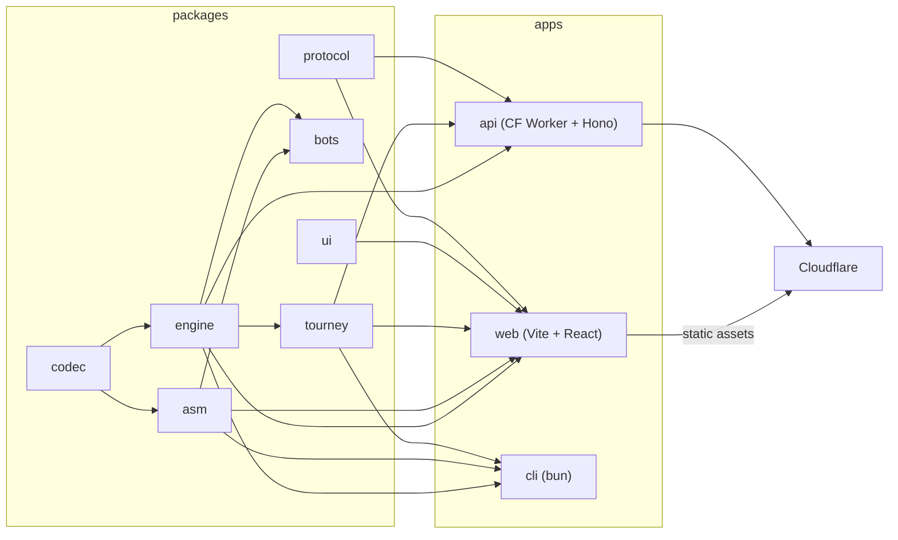

# ASM Bots v3 Architecture

## 1. Shape

One Bun monorepo. The engine is pure TypeScript with zero dependencies and runs identically in four places: Bun (tests, CLI), the browser main thread (debugger), a browser Web Worker (arena playback), and a Cloudflare Worker (authoritative hill results). Determinism (ISA_SPEC §5.6) makes that safe.



## 2. Repository layout

```
asm-bots-v3/
  package.json              bun workspaces, root scripts
  bunfig.toml
  tsconfig.base.json        strict, ES2022, bundler resolution
  biome.json                lint + format
  .github/workflows/ci.yml  bun install, typecheck, lint, test, build, golden
  docs/                     ISA_SPEC, ARCHITECTURE, DESIGN_SYSTEM, PRODUCT_SPEC, RESEARCH_BRIEF, guides/
  packages/
    codec/                  opcode table, encode, decode, length, formatting     (no deps)
    engine/                 core, cpu, process queues, battle, prng, events, snapshots (dep: codec)
    asm/                    lexer, parser, expr, assembler, listing, disassembler, formatter, lint (dep: codec)
    bots/                   roster/*.asm, src/roster.ts, goldens/*.json         (dep: asm, engine)
    tourney/                round, match, roundrobin, bracket, melee, hill, scoring, rating (dep: engine)
    protocol/               zod schemas: API DTOs, replay file, share links, WS messages (no deps)
    ui/                     tokens, themes, primitives, icons, hooks (dep: react)
  apps/
    web/                    Vite, React 19, TanStack Router + Query, Tailwind 4, CodeMirror 6, WebGL2
    api/                    Cloudflare Worker: Hono, D1, R2, KV, Durable Objects, cron; wrangler.jsonc
    cli/                    bun executable: asm, dis, fight, tourney, hill, bench, golden
```

Package names: `@asmbots/codec`, `@asmbots/engine`, etc.

## 3. Engine (packages/engine)

```ts
class Core { bytes: Uint8Array(65536); owner: Uint8Array(65536); read8/16, write8/16 (wrapping, owner-tagging) }
interface Proc { ax bx cx dx si di bp sp ip flags: number }        // stored in a Uint16Array ring per bot for speed
class Bot { index; name; queue: ProcQueue; alive; stats }
class Battle {
  constructor(bots: Loaded[], config: BattleConfig)
  step(): CycleEvents          // one cycle, all bots
  run(cycles: number): Result | null
  snapshot(): Snapshot         // structured clone-able
  static restore(s: Snapshot): Battle
  readonly cycle: number
  readonly events: EventSink   // pluggable; arena uses a ring buffer, headless uses a null sink
}
```

Events per cycle: `exec(bot, proc, addr, len)`, `write(bot, addr, len)`, `spawn(bot, addr)`, `death(bot, proc, addr, reason)`, `botDead(bot)`. The arena Worker batches events into typed arrays per frame.

Performance target: ≥ 25 M instructions/sec in Bun on an M-series laptop, measured by `apps/cli bench`. The decoder is a 256-entry table of closures, not a switch on strings. No allocation in the hot loop.

Snapshots: `{ cycle, core (copy), owner (copy), bots: [{ queue: Uint16Array }], prngState }`. Used by the debugger for step-back and by the arena for scrubbing (keyframe every 1,000 cycles, re-simulate forward from the nearest keyframe).

## 4. Assembler (packages/asm)

Two passes with expression constant-folding and a fixpoint for rel8/rel16 selection (iterate until no size changes; bounded at 16 iterations). Diagnostics carry `line, col, len, code`. The lint pass (separate, reusable by the editor) flags: absolute `[label]` without base register, unreachable code after `jmp`, `dat` inside the instruction stream, size over hill cap, missing `%name`.

The formatter canonicalizes whitespace, mnemonic case, and column alignment (labels col 0, mnemonics col 8, operands col 16, comments col 40). The editor's "Format" uses it. Roster bots are formatter-clean, enforced in CI.

## 5. Tournaments (packages/tourney)

```ts
runRound(bots, config)                         -> RoundResult
runMatch(bots, config, rounds)                 -> MatchResult  (seeds seed..seed+rounds-1, rotated order)
roundRobin(entrants, cfg)                      -> Standings    (every pair, or every k-subset for melee size k)
bracket(entrants, cfg, { size: 8|16|32, seeding }) -> Bracket   (single elimination; byes; third-place match)
melee(entrants, cfg)                           -> MeleeResult  (all in one core, up to 16)
hill(state, submission, cfg)                   -> HillState    (KOTH: fight everyone on the hill, insert by score, push the lowest off)
```

Scoring: pMARS points (ISA_SPEC §5.5). Ratings: Glicko-2 per bot across hill history, shown as a secondary number. Every function is pure and yields progress via an async iterator so the UI and the Durable Object can both drive it incrementally.

## 6. Web app (apps/web)

- **Routing**: TanStack Router, file-based. Routes: `/` (home + live ticker), `/arena`, `/arena/:replayId`, `/editor`, `/editor/:botId`, `/tournaments`, `/tournaments/:id`, `/hills`, `/hills/:slug`, `/bots/:id`, `/u/:handle`, `/docs/*`, `/settings`.
- **State**: TanStack Query for server data; Zustand for arena/editor session state; URL is the source of truth for shareable state (battle config + bot ids + seed are encoded in the query string).
- **Arena Worker**: `arena.worker.ts` owns a `Battle`. Main thread sends `{load, play, pause, seek, speed, step}`; Worker posts per-frame `FrameDelta { cycle, writes: Uint16Array, execs: Uint16Array, deaths, spawns, stats }` via transferables. Speed is cycles-per-frame, 1..10,000, plus "max".
- **Renderer**: WebGL2. Three 256x256 R8/R16 textures (owner, write-age, exec-age) uploaded per frame with `texSubImage2D`; one fullscreen quad; the fragment shader maps owner → theme palette, age → glow falloff, and draws the 1 px lattice, the ruler, and PC markers via a second instanced draw. Post pass: bloom (two-pass blur at quarter res) and optional scanline/vignette, both theme-controlled. Fallback: Canvas2D dirty-rect renderer when WebGL2 is unavailable.
- **Editor**: CodeMirror 6 with a hand-written stream tokenizer for x16c (fast, adequate for assembly), lint via `@asmbots/asm` on a debounce, gutter breakpoints, listing gutter (address + bytes), hover for opcode docs, autocomplete for mnemonics/registers/labels.
- **Debugger**: main-thread `Battle` (not the Worker) for synchronous stepping; panels: registers/flags, process queue, memory hex view centered on IP with disassembly, watch cells, breakpoints, step / step over `call` / run to cursor / run until death, step back (snapshot ring of 256).
- **Themes**: CSS variables on `<html data-theme>`, palette also exported as a `Float32Array` uniform for the shader. Five themes (DESIGN_SYSTEM).

## 7. Backend (apps/api) on Cloudflare

| Concern | Cloudflare primitive |
|---|---|
| Static site | Workers Static Assets (single Worker serves `apps/web/dist` + API; one deploy) |
| REST API | Hono router in the same Worker, `/api/*` |
| Relational data | D1 (`asmbots`): users, bots, bot_versions, hills, hill_entries, tournaments, matches, rounds, ratings |
| Replays and bot binaries | R2 (`asmbots-replays`): content-addressed by sha256 of `(isa, config, bots, seed)`; replay = inputs only, since simulation is deterministic |
| Sessions, rate limits, hot caches | KV (`asmbots-kv`) |
| Live rooms | Durable Object `LiveRoom` per tournament/hill: WebSocket fan-out of `{ matchStarted, matchFinished, standings }`; spectators simulate locally from the same inputs |
| Long-running hill/tournament execution | Durable Object `Runner` with alarms: one match per alarm, results persisted to D1 as they land; resumable; CPU-bounded per alarm |
| Scheduled championships | Cron trigger (weekly, Saturdays 18:00 UTC) starts the week's open championship in a `Runner` (a bracket of up to 32, seeded by rating) and makes next week's, which takes entries for six days |
| Auth | GitHub OAuth (players are developers) + guest sessions (play locally without an account; upload requires sign-in). Session cookie, HttpOnly, SameSite=Lax, 30 days, stored in KV |
| Abuse controls | bot size cap, per-user submission rate limit (KV), assembler runs server-side on submit, no arbitrary code ever runs server-side except the deterministic engine |
| Observability | Workers Analytics Engine for match counts and durations; `wrangler tail` in dev; structured JSON logs |

Verification model: the client may run anything locally. Anything that changes standings (hill submissions, tournament results) is simulated server-side by the `Runner` from inputs the server assembled itself. Clients can independently re-simulate any published result from its inputs and the site shows a "verified locally" check when they match.

### Data model (D1)

```sql
users(id, github_id, handle, avatar_url, created_at)
bots(id, owner_id, slug, name, created_at, updated_at, visibility)         -- visibility: private|unlisted|public
bot_versions(id, bot_id, version, source, bytes_sha256, size, author, strategy, isa, created_at)
hills(id, slug, name, description, size, rounds, config_json, created_at, revision, scoring)  -- scoring: duel|melee; revision guards Runner board writes
hill_entries(hill_id, bot_version_id, score, rating, wins, ties, losses, age, entered_at, rank)
tournaments(id, slug, name, kind, status, config_json, bracket_json, owner_id, starts_at, created_at, entry, entry_closes_at, champion_id, finished_at)  -- kind: roundrobin|bracket|melee; entry: invite|open; owner_id null = a championship (the weekly cron's); finished championships = the championships feed
tournament_entries(tournament_id, bot_version_id, seed, user_id, entered_at)  -- seed: the Runner's entrant order from its start; user_id: an open entry's user, one entry a user
matches(id, tournament_id, hill_id, a_version_id, b_version_id, participants_json, rounds, seed, result_json, replay_key, finished_at, match_key)  -- match_key: tourney matchHash
ratings(bot_version_id, hill_id, rating, rd, volatility, updated_at)          -- Glicko-2; each hill submission is one rating period
audit(id, user_id, action, target, at)                                     -- action: protocol AUDIT_ACTIONS
hill_submissions(id, hill_id, bot_version_id, user_id, status, score, rank, needed, created_at)  -- one Runner job each; one queued|running per user per hill
hill_history(id, hill_id, submission_id, event, bot_version_id, rank, score, delta, at)  -- event: entered|rejected|evicted|replaced; the hill page's feed
```

## 8. CLI (apps/cli)

```
asmbots asm <file.asm> [--listing] [--bin out.bin]
asmbots dis <file.bin> [--base 0]
asmbots fight a.asm b.asm [c.asm ...] [--seed N] [--rounds K] [--cycles N] [--json] [--trace]
asmbots tourney roundrobin|bracket|melee <dir or files> [--rounds K] [--out results.json]
asmbots hill submit <hill.json> <bot.asm>
asmbots bench [--seconds 5]
asmbots golden [--update]
```

`fight --trace` prints one line per cycle per process in the classic pMARS style; it is the ground truth when a UI number looks wrong.

## 9. Testing strategy

| Layer | Tests |
|---|---|
| codec | encode/decode round trip of every table row; the ISA_SPEC §8 vectors; 100k random byte strings decode without throwing; optional `ndisasm` cross-check when nasm is installed |
| engine | one test per instruction family asserting registers, memory, flags; REP interruption; SPL cap; placement spacing; determinism across runtimes (Bun and a Miniflare Worker in CI) |
| asm | every roster bot assembles with zero diagnostics; round trip `asm(dis(bytes)) == bytes`; formatter idempotent; lint fixtures |
| bots | goldens: `(roster matchup, seed) → survivors, cycle of last death, score`; `golden --update` regenerates with a review diff |
| tourney | bracket shapes for 3..32 entrants; hill insertion/eviction; scoring vs pMARS table |
| ui | `bun test` in jsdom with Testing Library (the DOM loads in a preload, `packages/ui/test/dom/preload.ts`): each primitive's DOM snapshot, ARIA roles, keyboard and pointer behavior; every class a primitive renders compiles in Tailwind; tokens match DESIGN_SYSTEM §2 and §3; WCAG contrast of the text tokens in all five themes |
| web | Playwright e2e: load two bots, run to completion, winner overlay visible; editor: type a bot, see lint, step in debugger; theme switch persists |
| api | Vitest with `@cloudflare/vitest-pool-workers`: auth flow, submit bot, hill run completes, replay fetch |
| perf | `bench` in CI with a floor (fail under 15 M instr/sec on the CI runner); Lighthouse CI ≥ 95 performance/accessibility/best-practices on `/` and `/arena` |

## 10. Release and deploy

- `main` deploys to production via `wrangler deploy` in GitHub Actions on push after CI passes. Preview deploys per PR via `wrangler versions upload`.
- Version stamp: `YYYY.MM.DD[letter]`, generated at build from the git date, shown bottom-right in the app (a v1 habit worth keeping).
- Migrations: `wrangler d1 migrations apply` in the deploy job.
- Secrets: `GITHUB_CLIENT_ID`, `GITHUB_CLIENT_SECRET`, `SESSION_SECRET` via `wrangler secret put`.
- Domain: bound in `wrangler.jsonc` `routes`; the human supplies it (HITL in the deploy playbook).
