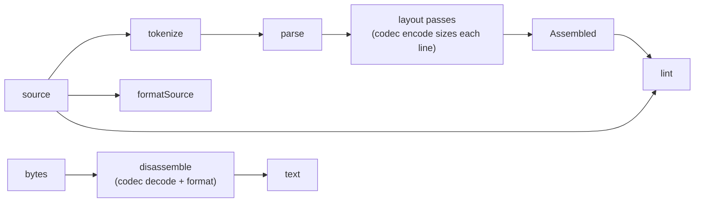

# @asmbots/asm

The x16c toolchain for bot source: lexer, parser, expression evaluator, two-pass assembler, disassembler, formatter, and linter. The contract is [ISA_SPEC](../../docs/ISA_SPEC.md) §6 and §7 and [ARCHITECTURE](../../docs/ARCHITECTURE.md) §4. The only dependency is `@asmbots/codec`, which holds all opcode knowledge: the assembler builds `InstrInput` objects and asks the codec's `encode` for the bytes, and the disassembler uses `decode` and `format`. The package uses no Node API, so it runs in Bun, the browser, Web Workers, and Cloudflare Workers.



## API

| Export | Does |
|---|---|
| `assemble(source, { maxBytes })` | Assembles a bot and returns an `Assembled` (see [Output](#output)). Bad source never throws: each problem is a diagnostic. `maxBytes` is the size limit, `MAX_BOT_BYTES` (512) when not given. |
| `assembleOrThrow(source, { maxBytes, file })` | For the CLI and scripts: the `Assembled`, or an `AssembleError`. Its `message` has one `formatDiag` line per error, with `file` before each, and its `diagnostics` has all of them. |
| `lint(source, assembled, { maxBytes })` | Warnings about a bot that assembles but may not do what its author means (see [Linter](#linter)). Give it the options that `assemble` got. It does not repeat the assembler's errors, so show both. |
| `formatSource(source)` | The canonical layout (see [Formatter](#formatter)). It never changes what the source assembles to. |
| `disassemble(bytes, base, { symbols })` | One `DisLine` (`{ address, length, text, bytesHex, kind }`) per instruction or loose byte. The texts assemble back to `bytes` (see [Disassembly](#disassembly)). |
| `tokenize(source, diags, { comments })` | The `Token`s of the source, ending in `eof`. Lexer errors go into `diags`. With `comments: true`, each comment is a `comment` token. |
| `parse(tokens)` | `{ lines, diags }`: one `Line` per source line, with `%define` expanded and `.local` names made full (`start.loop`). |
| `evaluate(expr, symbols, here)`, `evaluateExact(expr, symbols, here)` | The value of a parsed `Expr`, wrapped to 16 bits or exact, or an `Unresolved` for an undefined symbol or a division by zero. |
| `formatDiag(diag, file)` | A diagnostic on one line: `dwarf.asm:3:9: error: jump out of range [jump-out-of-range]`. |
| `DIAG_CODES` | Every `DiagCode`, in the order of the [codes table](#codes). |

Types: `Assembled`, `AssembleOptions`, `AssembleOrThrowOptions`, `ListingLine`, `Diag`, `DiagCode`, `DisLine`, `DisassembleOptions`, `Token` and its kinds, `TokenizeOptions`, `Parsed`, `Line` and its kinds, `OperandAst` and its kinds, `Expr` and its kinds, and `Unresolved`.

Apart from the `AssembleError` of `assembleOrThrow`, only bad options throw: `assemble`, `assembleOrThrow`, and `lint` throw a `RangeError` when `maxBytes` is not an integer in 0..65536, and `disassemble` does when `base` is not an integer in 0..0xFFFF.

```ts
import { assemble, assembleOrThrow, formatDiag, lint } from '@asmbots/asm'

// The editor: show everything, never throw.
const bot = assemble(source)
for (const d of [...bot.diagnostics, ...lint(source, bot)]) console.log(formatDiag(d, 'dwarf.asm'))

// The CLI: a bot or an AssembleError.
const { bytes } = assembleOrThrow(source, { file: 'dwarf.asm' })
```

## Output

`assemble` returns the `Assembled` of ISA §6.5:

| Field | Holds |
|---|---|
| `name`, `author`, `strategy`, `version` | The metadata texts, `''` for a directive that is not given. `%name` is required. |
| `bytes` | The bot image, at most `maxBytes` long. |
| `entry` | Always 0. |
| `symbols` | Label addresses and `equ` values, in source order. A `.local` label has its full name (`start.loop`). An `equ` value is exact, not wrapped: `K equ 0x10000` is 65536. |
| `listing` | One `ListingLine` per source line. |
| `sourceMap` | A `Uint16Array` with the 1-based source line of each byte. A line past 65535 reads as 65535. |
| `diagnostics` | The errors, sorted by line and then by column. The assembler gives no warnings; `lint` does. |

A bot with an error has empty `bytes`, `listing`, and `sourceMap`. Its metadata and `symbols` are what the assembler found.

### Listing

`ListingLine` is `{ lineNo, address, bytes, bytesHex, source }`, with one entry for each source line, blank and comment lines included: `listing[i].lineNo` is `i + 1`.

| Field | Holds |
|---|---|
| `lineNo` | The 1-based line number. |
| `address` | The address of the first byte of the line. A line with no bytes has the address of the next byte. |
| `bytes` | The bytes of the line, a view into `Assembled.bytes`. A `times` line holds all of its repeats, and `resb`, `resw`, and `align` hold their zeros. |
| `bytesHex` | `bytes` as uppercase hex pairs (`C7 05 00 00`), or `''`. |
| `source` | The line as written, without its line break. |

This bot, the dwarf of ISA §6 in the formatter's layout:

```nasm
%name     "Dwarf"
%strategy "DAT bombs every 4 bytes"

start:  call    .here
.here:  pop     bx
        sub     bx, .here
        lea     di, [bx+bomb]
.loop:  add     di, 4
        mov     word [di], 0
        jmp     .loop

bomb:   dat
```

assembles to 21 bytes. Its listing, as `lineNo`, `address` in hex, `bytesHex`, and `source`:

```text
line  addr  bytes        source
   1  0000               %name     "Dwarf"
   2  0000               %strategy "DAT bombs every 4 bytes"
   3  0000
   4  0000  E8 00 00     start:  call    .here
   5  0003  5B           .here:  pop     bx
   6  0004  83 EB 03             sub     bx, .here
   7  0007  8D 7F 13             lea     di, [bx+bomb]
   8  000A  83 C7 04     .loop:  add     di, 4
   9  000D  C7 05 00 00          mov     word [di], 0
  10  0011  EB F7                jmp     .loop
  11  0013
  12  0013  00 00        bomb:   dat
```

Its `symbols` are `start` 0, `start.here` 3, `start.loop` 10, and `bomb` 19. Its `sourceMap` is `4 4 4 5 6 6 6 7 7 7 8 8 8 9 9 9 9 10 10 12 12`.

## Diagnostics

`Diag` is `{ severity, line, col, len, message, code, fix? }`.

- `line` and `col` are 1-based. `col` counts UTF-16 code units, so a tab is one column, as in CodeMirror. `len` is the number of columns covered; 0 marks a point, such as the end of a line.
- `assemble` gives errors: from the lexer, the parser, the expressions, the encoder, and the layout. `lint` gives warnings, and each has a `fix`. An error gives its fix in `message`.
- The parser gives at most one error per line, and skips the rest of the line after it. A use of an `equ` that has no value gives no error: the line of the `equ` has the cause.
- `formatDiag` writes the one-line form, `file:line:col: severity: message [code]`, without the `fix`.

### Codes

Each example is a whole bot after a `%name` and a `%strategy` line are added at its end (no `%name` for `missing-name`, no `%strategy` for `no-strategy`). The example gives that code and no other.

| Code | Severity | From | Example | Meaning |
|---|---|---|---|---|
| `bad-char` | error | lexer | `db 1 @` | A character that starts no token. |
| `bad-escape` | error | lexer | `db 'a\q'` | An escape other than `\n \t \r \0 \\ \' \"`. |
| `bad-number` | error | lexer | `mov ax, 0x` | A number that is not one of the ISA §6.1 forms. |
| `unterminated-string` | error | lexer | `db "abc` | A string with no closing quote on its line. |
| `syntax` | error | parser | `mov ax bx` | A token out of place. |
| `unknown-mnemonic` | error | parser | `foo ax` | A word that is not an x16c instruction. |
| `invalid-address` | error | parser | `mov ax, [bx+bp]` | A memory operand that the 8086 cannot address. The forms are `bx` or `bp`, `si` or `di`, and a displacement, each optional. |
| `bad-operand` | error | parser | `dw "ab"` | An operand of the wrong kind. |
| `bad-label` | error | parser | `ax: nop` | A register, size word, or directive word as a label. |
| `bad-directive` | error | parser, assembler | `org 0x100` | A directive with a value it cannot take, or a metadata directive given twice. |
| `unsupported` | error | parser | `section .text` | A NASM feature that x16c leaves out (see [Dialect](#dialect)). |
| `undefined-symbol` | error | expressions | `jmp nowhere` | A name that no label or `equ` defines. |
| `div-zero` | error | expressions | `mov ax, 1/0` | A division or `%` by zero. |
| `invalid-prefix` | error | encoder | `rep add ax, bx` | A prefix on an instruction that cannot take it. |
| `invalid-operands` | error | encoder | `push 5` | No form of the instruction takes these operands. |
| `size-not-specified` | error | encoder | `mov [bx], 0` | No operand gives the size: add `byte` or `word`. |
| `size-mismatch` | error | encoder | `mov al, bx` | Operands of different sizes. |
| `dat-form` | error | encoder | `add byte [bx], al` | `add <mem8>, r8`, whose opcode `00` is DAT (ISA §9). |
| `jump-out-of-range` | error | encoder | `jz $ + 200` | A rel8 target out of reach: `short`, a conditional jump, a `loop` form, or `jcxz`. |
| `out-of-range` | error | encoder | `mov al, 256` | A value too big for its field. |
| `duplicate-symbol` | error | assembler | `x: nop`<br>`x: nop` | A label or `equ` name defined twice. |
| `circular-equ` | error | assembler | `a equ a` | An `equ` defined in terms of itself. |
| `missing-name` | error | assembler | `nop` | No `%name` line. |
| `no-convergence` | error | assembler | `a: add bx, 131 - (b - a)`<br>`b:` | Instruction sizes that still change after 16 passes. |
| `size-over-cap` | error | assembler | `times 600 nop` | A bot bigger than `maxBytes`. |
| `absolute-address` | warning | lint | `mov ax, [0x0100]` | A memory operand with no register: a fixed place in the core, not in the bot (ISA §6.4). |
| `unreachable` | warning | lint | `ret`<br>`nop` | Code after a `jmp`, `ret`, `hlt`, `int3`, or DAT, with no label before it. |
| `dat-in-code` | warning | lint | `nop`<br>`dat` | DAT that code falls into: `dat`, or the zeros of `resb`, `resw`, and `align`. |
| `size-near-cap` | warning | lint | `times 470 nop` | A bot of 90% of `maxBytes` or more. |
| `no-strategy` | warning | lint | `nop` | No `%strategy`, or an empty one. |
| `hlt-in-code` | warning | lint | `hlt` | A `hlt` that the bot runs. |
| `uninitialized-di` | warning | lint | `movsb` | A string instruction that uses di before any line sets di. |

## Dialect

x16c reads NASM syntax for the 8086 subset of ISA §3, and adds `dat`, `spl`, and the `%name`, `%author`, `%strategy`, and `%version` directives (ISA §6). Where it differs from NASM, it gives an error, not a guess. The NASM results below are from NASM 3.02 with `-f bin` and `cpu 8086`. NASM 2.16 gives the same results, except where a row says otherwise.

### Rejected

These NASM forms are errors in x16c. The message is the one x16c gives.

| Source | Code | Message |
|---|---|---|
| `section .text` | `unsupported` | sections are not supported: a bot is one block of code and data |
| `global start` | `unsupported` | `global` is not supported: a bot is one file, with no linker |
| `%include "lib.asm"` | `unsupported` | `%include` is not supported: a bot is one file |
| `incbin "data.bin"` | `unsupported` | `incbin` is not supported: a bot is one file |
| `%macro bomb 1` | `unsupported` | multi-line macros are not supported; `%define` makes one-line text macros |
| `%define sq(x) x*x` | `unsupported` | macro parameters are not supported |
| `%if 1` | `unsupported` | conditional assembly is not supported |
| `%rep 4` | `unsupported` | `%rep` is not supported; use `times` |
| `%assign n 1` | `unsupported` | unknown directive `%assign`; the directives are %define, %name, %author, %strategy, and %version |
| `[bits 16]` | `unsupported` | the bracket form of a directive is not supported: drop the [ ] |
| `mov ax, [es:bx]` | `unsupported` | segment registers are not supported: x16c has one flat 64 KB address space |
| `jmp 0x1234:0x5678` | `unsupported` | far pointers (segment:offset) are not supported: x16c has no segments |
| `jmp far [bx]` | `unsupported` | far jumps and pointers are not supported: x16c has no segments |
| `mov eax, 1` | `unsupported` | `eax` is a 32-bit register; the 8086 has 16-bit and 8-bit ones |
| `mov ax, dword [bx]` | `unsupported` | `dword` is not supported: operands are byte or word |
| `dd 1` | `unsupported` | `dd` is not supported: data is db or dw, space is resb or resw |
| `lock inc word [bx]` | `unsupported` | `lock` is not supported: the prefixes are rep, repe, and repne |
| `org 0x100` | `bad-directive` | `org` must be 0: bots are position independent (ISA §6.4) |
| `times 2 times 2 nop` | `bad-directive` | `times` repeats an instruction or data, not `times` |
| `cpu 8086` | `unknown-mnemonic` | unknown mnemonic `cpu` |
| `int 0x21` | `unknown-mnemonic` | unknown mnemonic `int` |
| `start` | `unknown-mnemonic` | unknown mnemonic `start` (if it is a label, add a colon: `start:`) |
| `push 5` | `invalid-operands` | invalid combination of opcode and operands |
| `jmp near [bx]` | `bad-operand` | `near` needs an address after it: `jmp near label` |
| `mov ax, [si*1]` | `invalid-address` | invalid effective address (8086 allows bx/bp + si/di + disp) |
| `rep` | `syntax` | expected an instruction after `rep`, found end of line |
| `dw "ab"` | `bad-operand` | `dw` takes numbers; a string goes in `db` |
| `mov ax, 'ab'` | `bad-operand` | a string can only stand alone, as a `db` item or directive text |
| `mov ax, 1010b` | `bad-number` | invalid number '1010b': 'b' is not a decimal digit (hex needs 0x or an h suffix, binary needs 0b) |
| `mov ax, $1F` | `bad-number` | NASM's `$` hex prefix is not supported: write 0x1F or 1Fh |
| `mov ax, 5 < 3` | `bad-char` | unexpected character '<' |
| `mov ax, 5 // 2` | `syntax` | expected an expression, found `/` |

The same errors cover the other words of each group:

- `segment` is `section`. `extern` and `common` are `global`. `cs`, `ds`, `ss`, `fs`, and `gs` are `es`, also in `push cs`. `seg` gives its own `unsupported` error. The other 32-bit registers are `eax`. `qword` and `tword` are `dword`. `dq`, `dt`, `resd`, `resq`, and `rest` are `dd`.
- The other `%` words: `%imacro` and `%endmacro` are `%macro`, the `%if` family is `%if`, `%endrep` is `%rep`, and `%use` is `%include`. Every other one, `%undef`, `%xdefine`, and `%idefine` included, is an unknown directive.
- Instructions: x16c has only the instructions of ISA §3. `int`, `in`, `out`, `les`, `lds`, `cli`, `sti`, `iret`, `retf`, `xlat`, the decimal-adjust instructions, and `wait` are `unknown-mnemonic`. The 80186 forms, `push imm`, a shift by a count other than 1 or `cl`, and a 3-operand `imul`, are `invalid-operands`. NASM also rejects the 80186 forms with `cpu 8086`.
- Numbers: the forms are those of ISA §6.1. NASM's `1010b`, `310q`, `0d200`, `1_000`, `1.5`, and `$1F` are `bad-number`. A backquote string is `bad-char`.
- Expressions: the operators are `+ - * / % << >> & | ^ ~ ( )` (ISA §6.1). NASM's `//`, `%%`, `<<<`, `>>>`, comparisons, `!`, `&&`, `||`, and `? :` are errors.
- Labels: a word without a colon is a label only before a statement word (`msg db 1`, `size equ 4`). NASM takes any word alone on a line as a label, with a warning.

### Errors where NASM guesses

| Source | Code | Message | NASM |
|---|---|---|---|
| `mov [bx], 0` | `size-not-specified` | operation size not specified | `C6 07 00`: a byte. NASM 2.16 gives the error. |
| `add byte [bx], al` | `dat-form` | this form encodes as 0x00 (DAT) and is unavailable; use `add <mem8>, imm8` or a word operation | `00 07`, which is DAT (ISA §9) |
| `rep add ax, bx` | `invalid-prefix` | `rep` needs a string instruction | `F3 01 D8` |
| `db 300` | `out-of-range` | `db` value 300 does not fit in a byte | `2C`, with a warning |
| `mov al, 256` | `out-of-range` | immediate 256 does not fit in a byte | `B0 00`, with a warning |
| `add word [bx], byte 200` | `out-of-range` | immediate 200 does not fit in a sign-extended byte | `83 07 C8`, with a warning |
| `jz $ + 200` | `jump-out-of-range` | jump out of range | `75 03 E9 C3 00`: a `jnz` over a `jmp near`. Without `cpu 8086`, the 386 form `0F 84 C4 00`. |

A `db` value or a byte immediate takes -256..255 after the 16-bit wrap, so `db -1` is `FF`. A sign-extended byte (`byte` on a word operation) takes -128..127. A word field takes any value and wraps it: `dw 0x10000` is `00 00`. Where a value does not fit, NASM warns and truncates it.

### Different bytes

These assemble in both, to different bytes.

| Source | x16c | NASM | Why |
|---|---|---|---|
| `add al, bl` | `02 C3` | `00 D8` | `00 /r` is DAT (ISA §9), so a byte `add` of two registers uses `02 /r`. |
| `xchg bx, cx` | `87 CB` | `87 D9` | The first operand goes in the ModR/M `rm` field, so the decoder gives the operands back in their order. |
| `xchg ax, ax` | `87 C0` | `90` | `90` is `nop`. |
| `start: add bx, start` | `83 C3 00` | `81 C3 00 00` | x16c sizes a label like any number, so a small address takes the short form. NASM always gives a label 16 bits. |
| `start: mov ax, [bx+start]` | `8B 07` | `8B 87 00 00` | The same rule for a displacement. The dwarf in [Listing](#listing) is 21 bytes, and 23 in NASM. |
| `a: add bx, (b - a) * 32`<br>`b:` | `81 C3 80 00` | `83 C3 60` | Pass 1 gives an unknown value the long form, where NASM guesses the short one. Only code whose size depends on itself can end differently. |
| `nop`<br>`align 4` | `90 00 00 00` | `90 90 90 90` | `align` pads with `00`, which is DAT (ISA §6.2). |
| `mov ax, -5 / 3` | `B8 FF FF` | `B8 53 55` | `/` is signed and truncates toward zero, as in C. NASM's `/` is unsigned; its signed one is `//`. |
| `mov ax, -5 % 3` | `B8 FE FF` | `B8 02 00` | `%` is signed and takes the sign of the dividend, as in C. NASM's `%` is unsigned; its signed one is `%%`. |
| `mov ax, -1 >> 63` | `B8 FF FF` | `B8 01 00` | `>>` is arithmetic. NASM's `>>` is logical; its arithmetic one is `>>>`. |
| `db 'a\n'` | `61 0A` | `61 5C 6E` | The escapes `\n \t \r \0 \\ \' \"` work in both quote styles. NASM has escapes only in backquotes. |
| `mov ax, 'é'` | `B8 E9 00` | `B8 C3 A9` | A one-character literal in an expression is its UTF-16 code. NASM uses its UTF-8 bytes. In `db`, both give the UTF-8 bytes. |

### Same as NASM

- Labels: `.name` is local to the last global label (`start.loop`). An `equ` name and a `..@name` do not start a scope. `$name` names a reserved word: `$ax:` defines the label `ax`. A mnemonic can be a label (`loop:`).
- `%define`: a one-line text macro without parameters. It applies from its line on, a new `%define` of the name replaces it, it expands where it is used, and it does not expand inside itself.
- `times`: `$` is the address of the `times` line in every repeat. Each repeat has its own relative targets and its own rel8 or rel16: `times 70 jmp start` mixes `EB` and `E9`.
- Sizes: `byte` on an immediate pins the imm8 field (`add ax, byte 5` is `83 C0 05`). Any size on an immediate gives that size to a memory operand without one (`add [bx], byte 5` is `80 07 05`). `strict` pins the field.
- Jumps: `short` forces rel8 and `near` forces rel16. Without them, a jump takes rel8 when rel8 reaches, and rel16 when it does not.
- Expressions: integer math, with one wrap to 16 bits at the end, so `(0x8000 * 4) / 8` is `0x4000`. The math is exact up to 2^53 in x16c and 2^64 in NASM. A shift count is taken mod 64. `$` is the address of the line and `$$` is 0.

## Disassembly

`disassemble(bytes, base)` sweeps from the start: each line starts where the line before it ends.

- An instruction prints as the codec's `format` writes it at its address, so a relative target is an absolute address (`jmp short 0x0100`). With `symbols`, a target at a named address prints as the name, with `$` before a reserved word (`jmp short $ax`). Names replace relative targets only, not immediates or `[disp16]`.
- DAT, HLT, and INT3 print as `dat`, `dat 0x41`, `hlt`, and `int3`, with kinds `dat`, `hlt`, and `int3`.
- A byte that starts no instruction prints as `db 0xNN`, with kind `undefined`, and the sweep goes on at the next byte. So does the first byte of an instruction that runs past the end of `bytes`: `90 B8 40` gives `nop`, `db 0xB8`, and `inc ax`. A lone `00` at the end is `db 0x00`.
- Twins: some instructions have two encodings (`03 D8` and `01 C3` are both `add bx, ax`), and NASM text assembles to only one of them, the one the codec's `encode` gives. In `roundtrip.test.ts`, 1,784 of the 68,519 defined instructions (2.6%) are twins. A twin prints as its bytes with the instruction as a comment, `db 0x03, 0xD8 ; add bx, ax`, with kind `instr`. The codec's `format` gives the plain text.

The round trip is exact for any byte string, not only for defined instructions: the texts assemble back to `bytes` when the first text is at address `base`. A bot starts at 0, so for another base, put the texts after `resb base`. With `symbols`, add the label lines back first. `test/roundtrip.test.ts` checks the round trip for the instructions of 100,000 random byte strings, 64 random 4 KB strings, 64 bases, and the fixture bots.

## Formatter

`formatSource(source)` gives the layout of ARCHITECTURE §4, as in the dwarf of [Listing](#listing). Each line ends in `\n`, and a source with nothing in it gives `''`. `formatSource(formatSource(s))` is `formatSource(s)`.

- Columns count from 0, with tab stops of 8: label 0, mnemonic 8, operands 16, and comment 40. A field that runs long pushes the next field to one space after it. A prefix goes in the mnemonic column and its instruction in the operand column (`rep     movsw`). Metadata text goes in column 10 (`%name     "Dwarf"`). `%define NAME` goes in columns 0 and 8, and its text in column 16.
- A label gets a colon: `msg db 1` becomes `msg:    db      1`. An `equ` name gets none (`size    equ     4`), except when the parser needs it (`loop: equ 4`).
- Blank lines: one blank line goes before a global-label block when that block or the block before it has 2 or more code lines, so one-line data labels stay together. Comment lines directly above a label move with it. A run of blank lines becomes one, with none at the start or the end.
- A comment-only line stays in column 0 if it starts there, and goes to column 8 if it does not. A comment-only line that starts in the column of the comment on the line above stays under that comment.
- Case: mnemonics, prefixes, registers, keywords, and directives become lowercase. Labels, symbols, macro names, and metadata text stay as written.
- Numbers and operators: hex becomes `0x` with uppercase digits (`0FFh` becomes `0xFF`, and `00FFh` becomes `0x00FF`), and binary becomes `0b`. Operands are separated by `, `. A binary operator has spaces around it outside `[ ]` and none inside: `$ + 2`, `[bx+si+4]`.
- Safety: formatting never changes the meaning. A line with a lexer or parser error stays exactly as written. A word that is a macro name keeps its case.

## Linter

`lint(source, assembled, opts)` parses the source again. It reads `assembled` only for the size and the listing. It gives warnings in source order, each with a `fix`. The [codes table](#codes) lists them. The details:

- `unreachable`: code after a `jmp`, `ret`, `hlt`, `int3`, or DAT, up to the next label, once per run. An `equ` name is not a label for this rule, and `db` and `dw` neither end nor start a run.
- `dat-in-code`: `dat`, or the zeros of `resb`, `resw`, and `align`, after an instruction that falls through. An `align` counts only when the listing shows padding, so a bot with errors gets no `align` warning.
- `hlt-in-code`: the first instruction, a `hlt` that code falls into, and a `hlt` under a label that a jump, call, loop, or `spl` names. A bomb template after a `jmp` gets no warning.
- `uninitialized-di`: works in source order, not in execution order. `mov`, `lea`, `pop`, the ALU instructions, the shifts, `inc`, `dec`, `neg`, and `not` set di when di is the first operand, and `xchg` sets di on either side. `cmp`, `test`, `push`, and `[di]` only read di.
- `size-near-cap`: only for a bot without errors, on the listing line where the bot reaches 90% (`size * 10 >= maxBytes * 9`).
- `no-strategy`: on the `%name` line (or 1:1 without one), or on the text of an empty `%strategy`.

`lint` does not read `; lint: allow <code>` comments. A caller that allows a warning drops it.

## Limits

The hills take source from anyone, so the assembler has limits:

- `%define` expansion: 10,000 tokens per line and 256 levels of nesting. Expressions: 1,024 operators. Past a limit, the result is a diagnostic, not a stack overflow.
- Layout stops when a bot gets past 64 KB, with `size-over-cap` ("more than 65536 bytes").
- The work is linear in the lines plus the bytes. On 2026-09-23 (Apple M5 Max, Bun 1.3.6), a 10,000-line bot assembled in about 45 ms, and a 50,000-line bot formatted in about 150 ms and linted in about 85 ms.

## Tests

`bun test packages/asm` runs the suite. The fixtures are expected results: after a deliberate change, run `UPDATE_FIXTURES=1 bun test packages/asm` and review the diff.

| File | Checks |
|---|---|
| `lexer.test.ts`, `expr.test.ts` | Tokens, number forms, escapes, and columns; expression values, precedence, and limits. |
| `parser.test.ts` | `fixtures/parse/*.asm` against their AST JSON, and error fixtures with codes and columns. |
| `assemble.test.ts` | The ISA §8 vectors, references, `times`, the size fixpoint, and every assembler error. With nasm installed, 120 seeded random programs against `nasm -f bin`. |
| `disassemble.test.ts`, `roundtrip.test.ts` | The disassembler, and the round trip of [Disassembly](#disassembly). |
| `format.test.ts` | `fixtures/format/*.asm` against their `.fmt.asm` goldens, idempotence over every fixture, and 2,000 seeded random programs that format to the same parse, diagnostics, and bytes. |
| `lint.test.ts` | `fixtures/lint/*.asm` against their warning JSON. |
| `api.test.ts` | The exports, `assembleOrThrow`, `formatDiag`, and the dependency rule: no import other than `@asmbots/codec`. |
| `readme.test.ts` | This file: the codes table against `DIAG_CODES` and its examples, the dialect tables against the assembler, and the listing example. |

To add a diagnostic code, add it to `DIAG_CODES` in `src/diag.ts` and add a row with an example to the [codes table](#codes). `readme.test.ts` fails until both are done.
