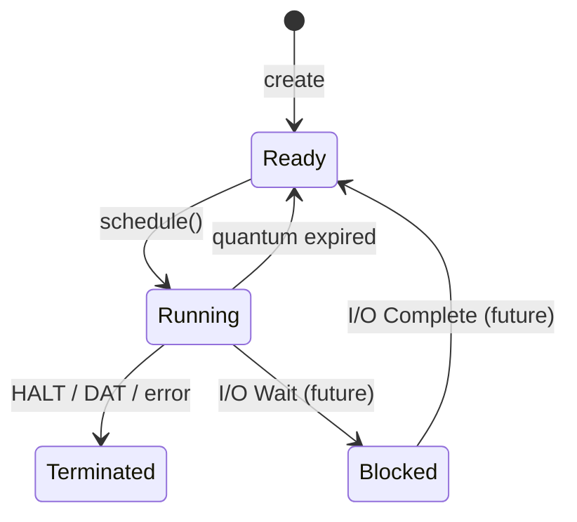

# Process Model Specification

This document defines the data structure and lifecycle of a `Process` within the ASM Bots system.

## 1. Process State Object

A `Process` represents a single execution context of a bot.

```typescript
export type ProcessId = number;

export interface Process {
  id: ProcessId;             // Unique identifier, assigned sequentially, never reused
  name: string;              // Bot display name
  owner: string;             // Username or entity owning the bot
  priority: number;          // Scheduling priority (higher = more frequent; default 1)
  quantum: number;           // Maximum cycles allowed per scheduling window (default 5)
  cyclesUsed: number;        // Lifetime total cycles executed
  memoryUsed: number;        // Total bytes occupied by its segments
  createdAt: number;         // Unix timestamp of creation
  lastRun: number;           // Unix timestamp of last execution
  context: ProcessContext;
}

export interface ProcessContext {
  registers: Registers;
  memory: MemorySegment[];   // Pointers to segments in the shared MemorySystem
  cycles: number;            // Cycles consumed in the current quantum
  state: ProcessState;
  currentInstruction: string; // Mnemonic of the instruction being executed
}

export interface Registers {
  r0: number;
  r1: number;
  r2: number;
  r3: number;
  sp: number;
  pc: number;
  flags: number;
}

export type ProcessState = 'Ready' | 'Running' | 'Blocked' | 'Terminated';
```

## 2. Lifecycle State Machine

A process transitions through states based on scheduler decisions and instruction execution.

### State Transitions

| Current State | Event | Next State | Action |
| :--- | :--- | :--- | :--- |
| (None) | `create` | `Ready` | Initialize registers, assign ID, add to Ready queue |
| `Ready` | `schedule()` | `Running` | Set as current process, reset `cycles` to 0 |
| `Running` | `quantum_expired` | `Ready` | Reset `cycles`, move to end of Ready queue |
| `Running` | `HALT` / `DAT` / `error` | `Terminated` | Release resources, record termination time |
| `Running` | `I/O_Wait` | `Blocked` | (Reserved for future use) |

### Lifecycle Diagram



## 3. Resource & Constraint Model

### Memory Sharing
Processes created via `SPL` share the same `MemorySegment` references as their parent. They possess independent registers and program counters, meaning they operate on a shared memory space.

### Process Cap
To prevent resource exhaustion (via "fork bombs" such as `vampire.asm`), the system enforces a global limit on the number of active processes.

- **Global Limit**: 32 processes per battle.
- **Behavior**: When `maxProcesses` is reached, any `SPL` instruction is treated as a `NOP` (no-op) and the parent continues execution.

## 4. Termination & Cleanup

When a process enters the `Terminated` state:
1. **Immediate Exit**: It is removed from the scheduling rotation.
2. **Timestamping**: `lastRun` is updated to the exact time of death for victory tie-breaking.
3. **Resource Release**: The `context` (registers, memory references, `currentInstruction`) is cleared.
4. **Memory Persistence**: The ownership map in the shared memory system persists; cells owned by the terminated process remain visually associated with that process's identity until overwritten.
